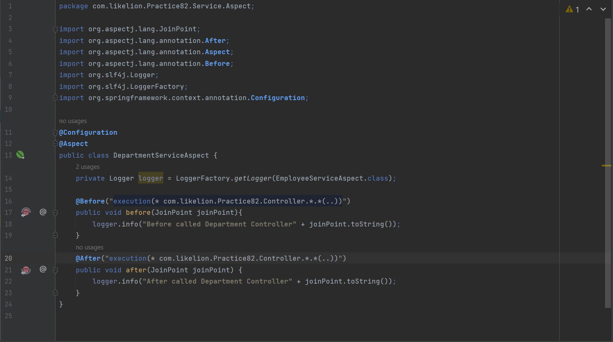

# PRACTICE WEEK 8.2
## Main contents:
<!-- TABLE OF CONTENTS -->

  
Table of Contents

  <ol>
    <li><a href="#task-1">Task 1</a></li>
    <li><a href="#task-2">Task 2</a></li>
    <li><a href="#task-3">Task 3</a></li>
    <li><a href="#task-4">Task 4</a></li>
  </ol>

<h1 align="center">
   
  Spring Boot Practice
   
</h1>

<h4 align="center">AOP & Filter Request & Validation Spring Boot.</h4>

## Task 1
Configure application.properties

## Task 2
### EmployeeDTO

### DepartmentDTO

### Test Valid DTO
- Valid Employee DTO

- Valid Department DTO

## Task 3
- Code EmployeeServiceAspect:

- Code DepartmentServiceAspect:

## Task 4
1. Interceptor
- Handling Interceptor

- Config Interceptor

- Time execution

2. Filter

